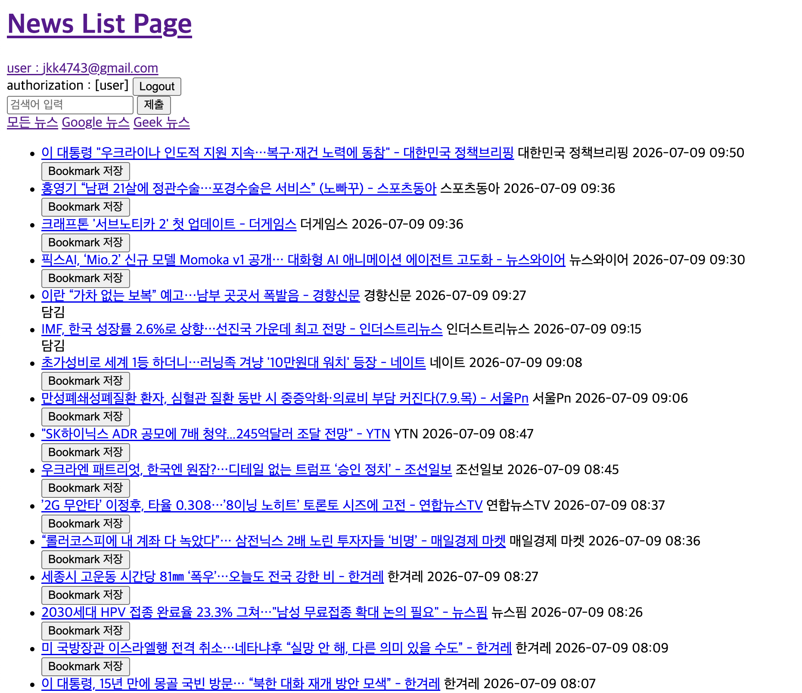
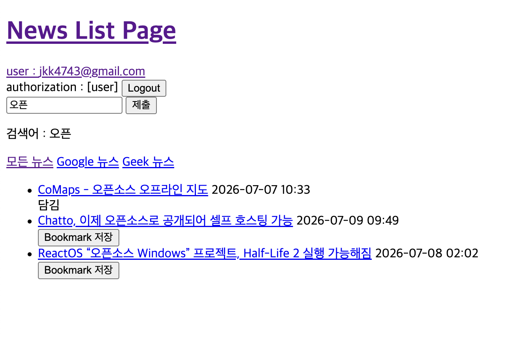
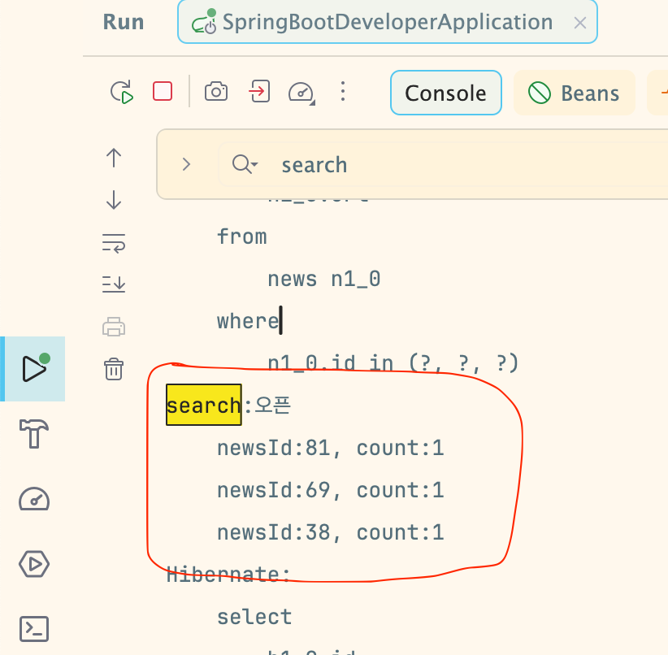
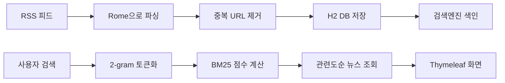

## 0. SpringBoot 구조에 대한 내용정리
- [Java와 Spring Boot](docs/springboot.md)
- [Spring 테스트 코드](docs/testcode.md)
- [Database와 JPA](docs/database.md)
- [RSS 뉴스 아카이브 구현](docs/rss.md)
- [검색엔진 구현](docs/searchEngine.md)
- [Spring Security](docs/spring-security.md)
- [Template Engine](docs/templateEngine.md)


# RSS 뉴스 아카이브

RSS로 뉴스를 수집, 검색엔진을 적용한 Spring Boot 프로젝트

- Google News와 GeekNews의 RSS 피드를 주기적으로 수집해 한곳에서 조회할 수 있도록 만든 뉴스 아카이브  
- 회원은 관심 있는 뉴스를 북마크할 수 있다. 
- 뉴스 제목과 언론사를 색인한 검색엔진으로 키워드 검색이 가능하다

## 2. 주요 기능

- RSS 피드 자동·수동 수집
- 출처별 뉴스 필터링
- 키워드 검색 및 관련도순 정렬
- 회원별 북마크 및 관리
- URL 기준 중복 뉴스 저장 방지

## 3. 실행 화면

| 화면 | 보여줄 내용 |
| --- | --- |
| 뉴스 목록 | 출처 필터와 수집된 기사 목록 |
| 검색 결과 | 한글 키워드 검색 결과와 검색어가 유지된 필터 |
| 내 뉴스 | 로그인 사용자가 저장한 북마크 목록 |





## 4. 전체 동작 흐름



애플리케이션 시작 시 DB의 기존 뉴스를 다시 색인하고, 이후 새로 수집된 뉴스는 저장 직후 검색 색인에 추가한다.

## 5. 핵심 기능

### RSS 수집

- Rome 라이브러리로 여러 RSS 피드를 파싱한다.
- 스케줄러와 수동 수집 요청이 같은 수집 로직을 사용한다.
- 기사 URL을 기준으로 이미 저장된 뉴스는 제외한다.

### 로그인과 북마크

- Spring Security의 폼 로그인을 사용함.
- 비밀번호는 BCrypt로 암호화해 저장한다.
- 사용자와 뉴스의 연관 관계로 개인 북마크를 관리한다.

### 검색엔진

- 뉴스의 `제목 + 언론사`를 검색 문서로 구성
- 한글 부분 검색을 위해 2-gram 방식으로 토큰화한다.
- 역색인에서 후보 문서를 찾고 BM25 점수로 결과를 정렬한다.
- 검색 결과의 뉴스 ID를 DB 엔티티로 변환하면서 관련도 순서를 유지한다.

## 6. 스택

| 구분 | 기술 |
| --- | --- |
| Backend | Java, Spring Boot, Spring MVC |
| Data | Spring Data JPA, H2 |
| Security | Spring Security, BCrypt |
| View | Thymeleaf, JavaScript |
| RSS | Rome |
| Search | 2-gram, Inverted Index, BM25 |
| Build | Gradle |

## 7. 실행 방법

### 요구 사항

- JDK 17 이상

### 실행

```bash
./gradlew bootRun
```

- http://localhost:8080/news
- RSS 주소와 수집 주기는 `src/main/resources/application.yml`에서 변경이 가능하다


---

1. news의 content도 토큰화+역색인해서 검색엔진에 반영
2. DB를 PostgreSQL로 변경
3. CSRF 체크
4. 테스트 코드 재정비
5. Docker 서적 읽어보기
6. 